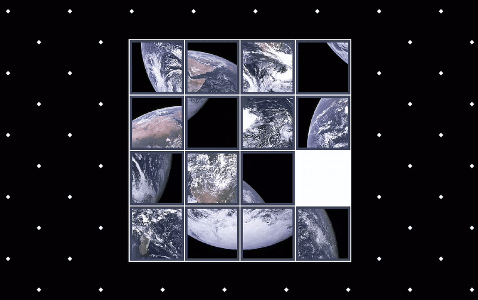

# Simple Sliding Puzzle
This is a simple puzzle game where the aim is to slide pieces to make an image out of tiles.

Sliding puzzles are a common type of grid puzzle; information about them can be found on [Wikipedia](https://en.wikipedia.org/wiki/Sliding_puzzle).

## Gameplay

Control the tiles by using the `W` `A`, `S`, `D` or arrow keys on a keyboard.

## Build Instructions

This project can be built and run with the command

`zig build run`

A release build can be created with the following command.

`zig build -Doptimize=ReleaseFast`

Building the project requires the compiler to be version `0.15.1` at minimum, available from the [download page](https://ziglang.org/download/) on `ziglang.org`.

This project has been tested with on Windows 11; compilation of the game on other operating systems has not been tested.

## Dependencies

The project is written in Zig and uses two Zig gamedev libraries: `zglfw`, `zopengl`. Both are fetched by the compiler the first time `zig build run` is invoked.

Nonetheless, both are available on GitHub at: https://github.com/zig-gamedev

## Development

The entire development of this app (basically) was streamed on Twitch and recordings were uploaded to YouTube at:

https://www.twitch.tv/10aded

https://www.youtube.com/@10aded

The project was originally built with a dev Zig `0.14.0-dev.3020+c104e8644` compiler, and updated to use Zig `0.15.1` in 26 August 2025
